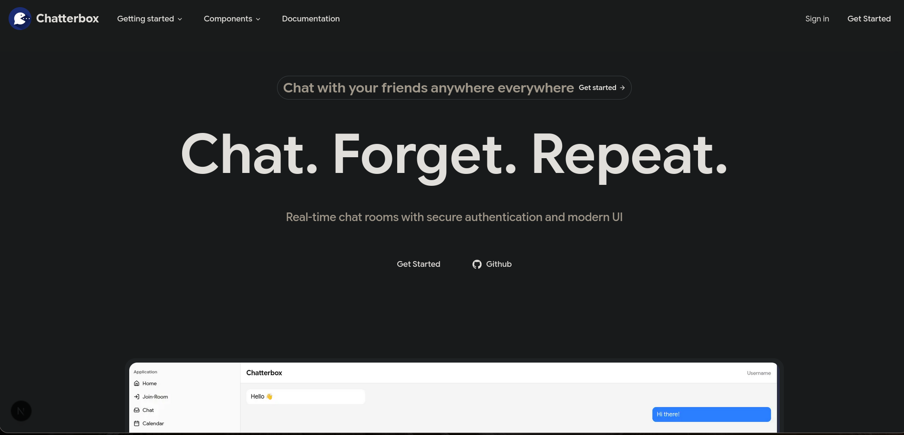
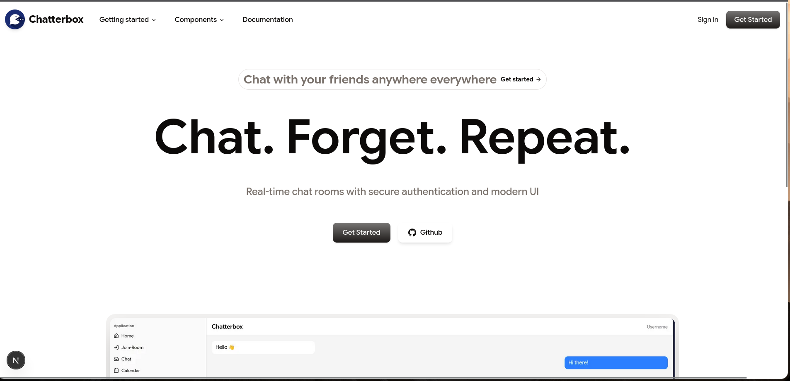
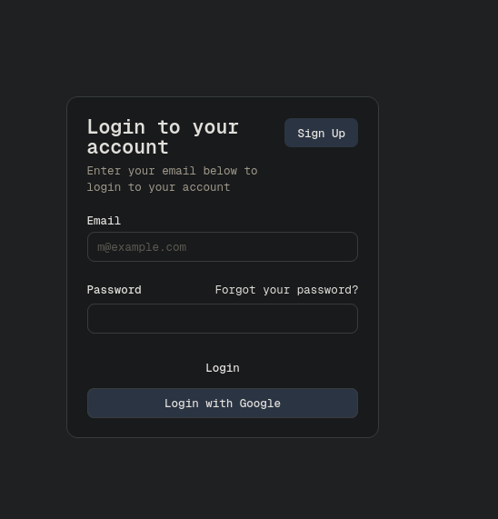
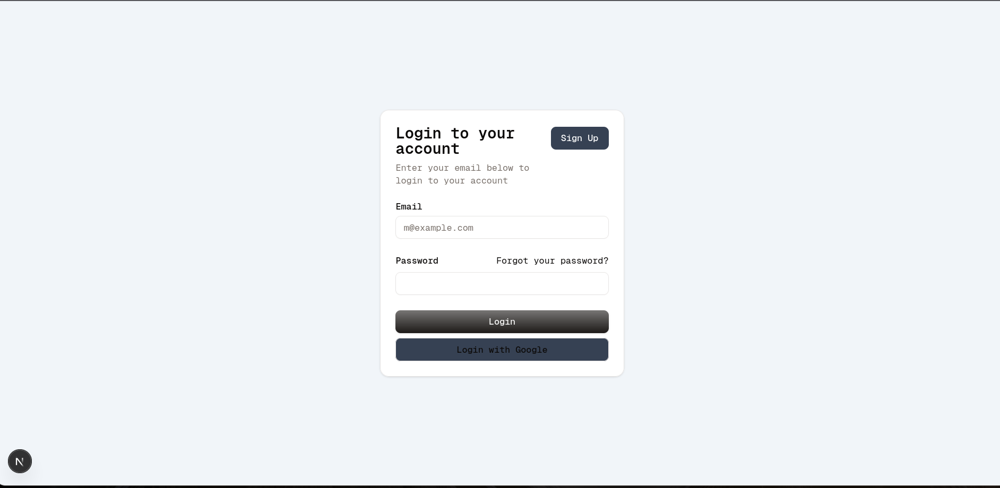
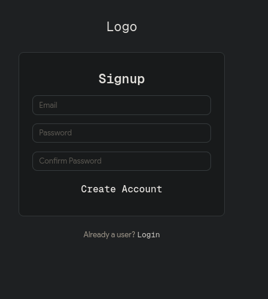
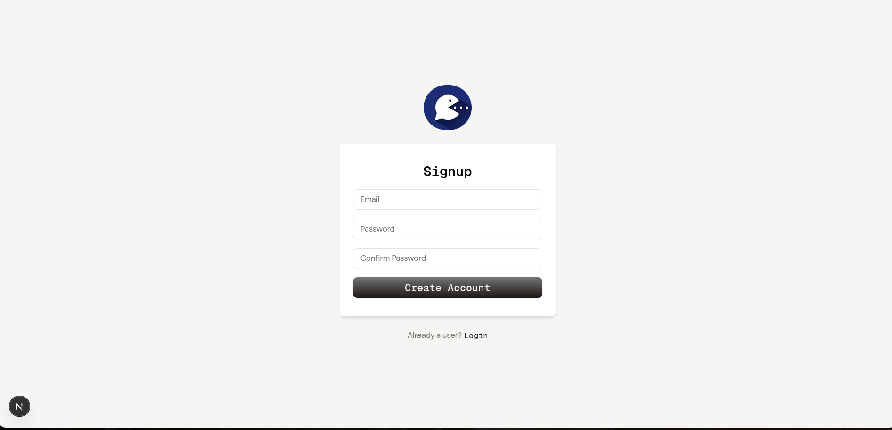

# Chatterbox
ChatterBox is a full-stack real-time chat application built with Next.js, React, Express.js, and SQL, delivering a fast, responsive, and user-friendly messaging experience with reliable data storage and scalable architecture.

<br>
<br>
How to Install & Run Locally

1) Clone the repository

git clone https://github.com/Priyanshuuk/chatterbox.git


2) Navigate into the project directory

cd chatterbox


3) Install dependencies

npm install


4) Start the development server

npm run dev


5) Create an account using the signup page

6) Log in with your credentials

7) Start chatting with your friends in real time

<br>
<br>
<h1>Technologies used</h1>


<h3>Frontend</h3>


1) Next.js – Full-stack React framework

2) React.js – Component-based UI development

3) Tailwind CSS – Utility-first styling

4) shadcn/ui – Reusable and accessible UI components


<h3>Backend</h3>

1) Express.js – Server-side application logic

2) Node.js – JavaScript runtime environment

3) Socket.IO – Real-time communication


<h3>Database</h3>

1) SQL 


## Getting Started

First, run the development server:

```bash
npm run dev
# or
yarn dev
# or
pnpm dev
# or
bun dev
```

Open [http://localhost:3000](http://localhost:3000) with your browser to see the result.

<br>
<br>
<h2>Screenshots</h2>
<br>

### Landing



### Login



### Signup



### Chat


