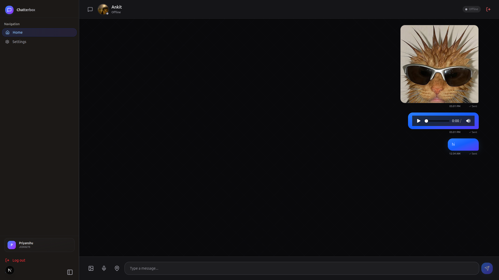
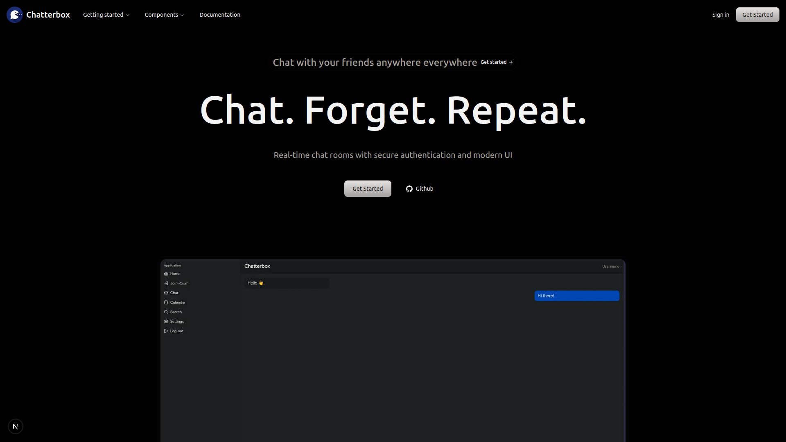
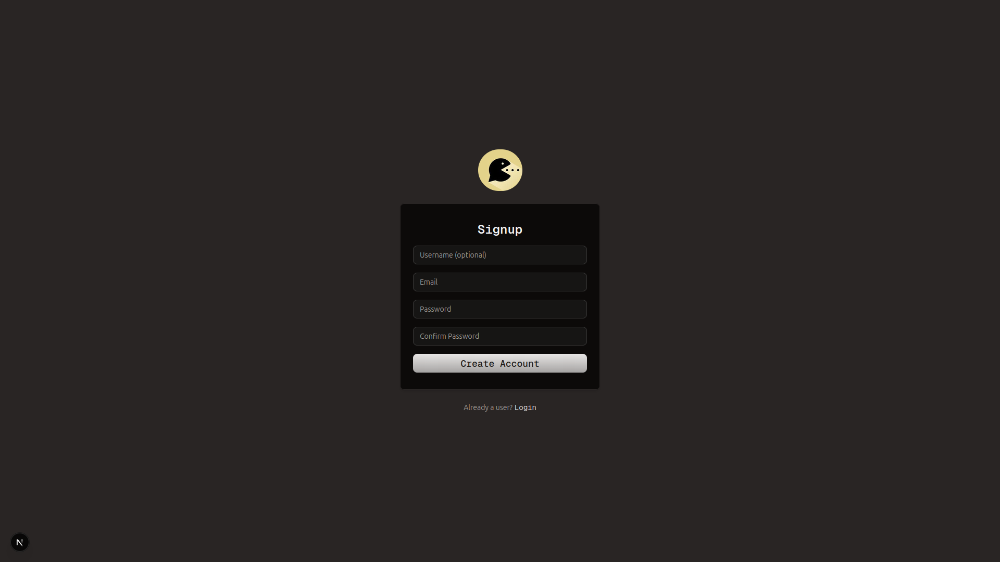
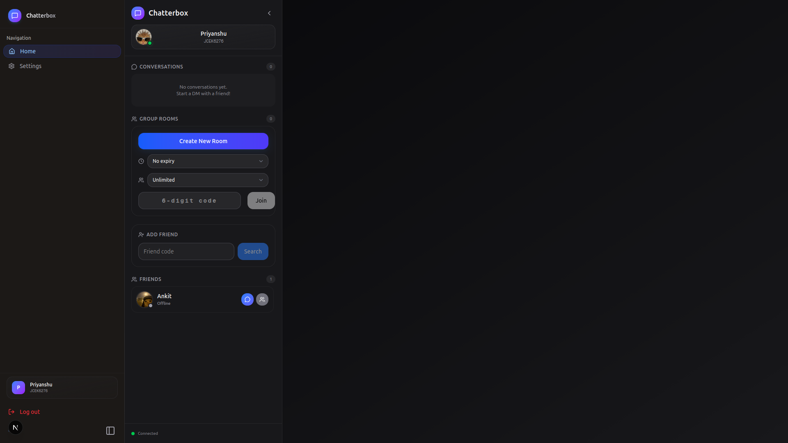
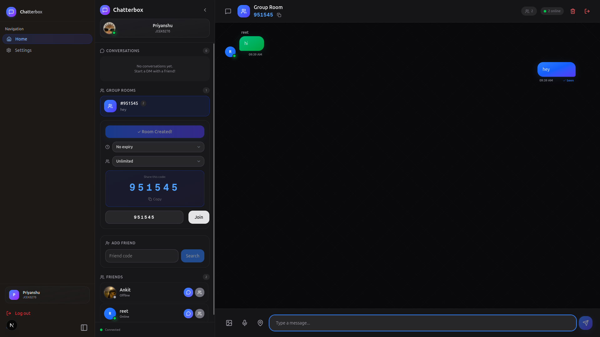

<div align="center">
  
</div>

<h1 align="center">💬 ChatterBox</h1>

<p align="center">
  <strong>A full-stack real-time chat application with group rooms, direct messaging, media sharing, and live presence indicators.</strong>
</p>

<p align="center">
  
  
  
  
  
  
  
</p>

---

## ✨ Features

### 💬 Real-Time Messaging
- **Group Rooms** — Create or join rooms via 6-digit codes with optional expiry and participant limits.
- **Direct Messages (DMs)** — Private conversations with any friend.
- **Typing Indicators** — Messenger-style live typing status.
- **Read Receipts** — "Sent" / "Seen" indicators on every message.
- **Message Deletion** — Delete your own messages; room creators can delete any message.

### 👥 User & Friend System
- **JWT Authentication** — Secure signup, login, and session management.
- **Friend Codes** — Add friends via unique 8-character alphanumeric codes.
- **Friend Requests** — Send, accept, or reject with real-time notifications.
- **Online Presence** — Live online/offline indicators for friends and room members.

### 🎙️ Rich Media Sharing
- **Image Uploads** — Share images directly in chat.
- **Voice Messages** — Record and send audio messages (browser MediaRecorder API).
- **GPS Location** — Share your real-time location via the browser Geolocation API.

### 🔒 Security & Privacy
- **Anti-Screenshot Protection** — Disables right-click, PrintScreen key, and DevTools shortcuts (Ctrl+Shift+I/J/C).
- **Watermark Overlay** — Invisible background pattern to deter unauthorized captures.
- **Session Rooms** — Rooms can auto-expire (5 min – 24 hr) for ephemeral conversations.

### 🎨 Modern UI/UX
- **Dark & Light Themes** — Seamless theme switching with `next-themes`.
- **Glassmorphism Design** — Elegant frosted-glass UI with gradient accents.
- **Responsive Sidebar** — Collapsible icon mode (Ctrl+B) and mobile hamburger menu.
- **Animations** — Smooth transitions, message bubble glow shadows, and loading skeletons.

---

## 🖼️ Screenshots

<div align="center">
  <table>
    <tr>
      <td></td>
      <td></td>
    </tr>
    <tr>
      <td align="center"><em>Landing Page</em></td>
      <td align="center"><em>Signup</em></td>
    </tr>
    <tr>
      <td></td>
      <td></td>
    </tr>
    <tr>
      <td align="center"><em>Home / Dashboard</em></td>
      <td align="center"><em>Chat Dashboard</em></td>
    </tr>
    <tr>
      <td></td>
    </tr>
    <tr>
      <td align="center" colspan="2"><em>Group Chat Room</em></td>
    </tr>
  </table>
</div>

---

## 🛠️ Tech Stack

| Layer | Technologies |
|-------|-------------|
| **Frontend** | Next.js 16 (App Router), React 19, TypeScript, Tailwind CSS 4, shadcn/ui, Lucide Icons |
| **Backend** | Express.js 5, Socket.IO 4, Node.js |
| **Database** | MongoDB + Mongoose 9 |
| **Auth** | JWT (jsonwebtoken), bcryptjs |
| **Real-Time** | Socket.IO (WebSocket with JWT auth middleware) |
| **Media** | Multer (file uploads), MediaRecorder API (voice), Geolocation API (location) |
| **Dev Tools** | ESLint 9, PostCSS, tsx, Babel React Compiler, tw-animate-css |

---

## 📁 Project Structure

```
chatterbox/
├── server/
│   └── index.ts            # Express + Socket.IO server (port 3001)
├── src/
│   ├── app/                # Next.js App Router
│   │   ├── (auth)/         # Login & signup pages
│   │   ├── chatterbox/     # Authenticated app (chat, settings, join-room)
│   │   ├── api/            # REST API routes (auth, users, rooms, messages, friends, DMs)
│   │   └── docs/           # Application documentation
│   ├── components/
│   │   ├── ui/             # shadcn/ui components + chat, sidebar, etc.
│   │   ├── sections/       # Landing page sections (navbar, hero)
│   │   └── logos/          # SVG logo components
│   ├── hooks/              # Custom React hooks
│   ├── lib/                # Utilities (auth, DB connection, API middleware)
│   └── model/              # Mongoose models (User, Room, Message, FriendRequest)
└── uploads/                # User-uploaded files (images, audio)
```

---

## 🚀 Getting Started

### Prerequisites

- **Node.js** >= 18
- **MongoDB** instance (local or Atlas)

### Installation

```bash
# Clone the repository
git clone https://github.com/Priyanshuuk/chatterbox.git
cd chatterbox

# Install dependencies
npm install

# Configure environment variables
# Edit the .env file with your MongoDB URI and a secure JWT secret:
#   MONGODB_URI=mongodb+srv://<user>:<password>@<cluster>/chatapp
#   JWT_SECRET=<your-secret-key>

# Start the development server (Next.js + Socket.IO concurrently)
npm run dev
```

Open [http://localhost:3000](http://localhost:3000) in your browser.

### Available Scripts

| Command | Description |
|---------|-------------|
| `npm run dev` | Start both Next.js and Socket.IO server in development mode |
| `npm run dev:next` | Start only the Next.js dev server |
| `npm run dev:socket` | Start only the Socket.IO server with hot-reload |
| `npm run build` | Build the Next.js app for production |
| `npm run start` | Run the production build + Socket.IO server |
| `npm run lint` | Run ESLint across the codebase |

---

## 🔌 API Overview

### Authentication
| Method | Endpoint | Description |
|--------|----------|-------------|
| POST | `/api/auth/signup` | Create a new account |
| POST | `/api/auth/login` | Log in with credentials |
| POST | `/api/auth/logout` | Clear session cookie |

### Users & Profile
| Method | Endpoint | Description |
|--------|----------|-------------|
| GET | `/api/me` | Get the current authenticated user |
| PATCH | `/api/user` | Update profile (username, avatar) |

### Rooms
| Method | Endpoint | Description |
|--------|----------|-------------|
| POST | `/api/rooms` | Create a new group room |
| GET | `/api/rooms/list` | List user's group rooms |
| POST | `/api/rooms/join` | Join a room by code |
| GET | `/api/room/members` | Get room participants |

### Messages
| Method | Endpoint | Description |
|--------|----------|-------------|
| GET | `/api/messages` | Get messages for a room |

### Friends
| Method | Endpoint | Description |
|--------|----------|-------------|
| GET | `/api/friends` | List friends |
| POST | `/api/friends/search` | Search users by friend code |
| POST | `/api/friends/request` | Send a friend request |
| GET | `/api/friends/requests` | Get pending requests |
| POST | `/api/friends/respond` | Accept or reject a request |

### Direct Messages
| Method | Endpoint | Description |
|--------|----------|-------------|
| GET | `/api/dm/list` | List DM conversations |
| POST | `/api/dm/start` | Start a new DM |
| DELETE | `/api/dm/delete` | Delete a DM conversation |

---

## 🔌 Socket.IO Events

| Event | Direction | Description |
|-------|-----------|-------------|
| `create-room` | Client → Server | Create a new room |
| `join-room` | Client → Server | Join an existing room |
| `leave-room` | Client → Server | Leave a room |
| `send-message` | Client → Server | Send a chat message |
| `delete-message` | Client → Server | Delete a message |
| `typing` / `stop-typing` | Client → Server | Typing indicators |
| `remove-user` | Client → Server | Kick a user (room creator only) |
| `delete-room` | Client → Server | Delete a room (creator only) |
| `new-message` | Server → Client | Incoming message |
| `message-deleted` | Server → Client | Message removed |
| `user-joined` / `user-left` | Server → Client | Room presence updates |
| `friend-request` / `friend-request-accepted` | Server → Client | Friend request notifications |
| `friend-chat-invite` | Server → Client | Invite to join a chat room |

---

## 🤝 Contributing

Contributions are welcome! Feel free to open issues and pull requests.

1. Fork the repository
2. Create a feature branch (`git checkout -b feature/amazing-feature`)
3. Commit your changes (`git commit -m 'Add amazing feature'`)
4. Push to the branch (`git push origin feature/amazing-feature`)
5. Open a Pull Request

---


